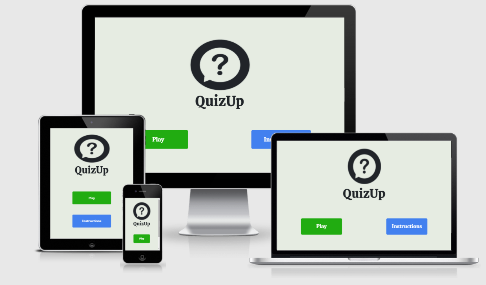

# QuizUp

The purpose of this website is to create a fun interactive quiz game using the [Open Trivia Database REST API.](https://www.programmableweb.com/api/open-trivia-database-rest-api-v1)

Link to the deployed website is [here](https://jamessinnott1994.github.io/Quiz-Game/).

## Table of Contents
- [User Experience (UX)](#user-experience-(ux))
    - [Strategy](#strategy)
        - [User Stories](#user-stories)
        - [Project Goal](#project-goal)
        - [Strategy Tradeoffs](#strategy-tradeoffs)
    - [Scope](#scope)
    - [Structure](#structure)
    - [Skeleton](#skeleton)
    - [Surface](#surface)
        - [Typography](#typography)
        - [Colour Scheme](#colour-scheme)
        - [Media](#media)
        - [Effects](#effects)
- [Technologies](#technologies)
- [Testing](#testing)
- [Deployment](#deployment)
- [Credits](#credits)

---
## User Experience (UX)

### Strategy

#### User Stories
As a **first-time player**, I want:
1. To see a visually appealing game.
2. To easily understand how the game works.
3. To be able to pick a quiz topic.
4. To be given feedback on my answers.
5. To be rewarded when I get the right answer.
6. To be able to see my score.

As a **returning player**, I want:
1.	To skip any instructions and jump straight into a new game.
2. To increase the difficulty for new challenges.
3. A large number of questions so that my playing experience is always different.

As a **site owner**, I want:
1.	To provide a fun interactive game for users.
2. To provide an inituitive game that will not confuse users.
3. To provide an educational game for users.
4. To create a game that is available on different devices.
5. To create a game that makes users want to play it again.

#### Project Goal
- Project goal:
    - The goal of this Quiz application is to provide an enjoyable interactive game that will test a user's general knowledge or knowledge about a specific topic. The game should be easy to understand, simple to interact with and give feedback to the user on all inputs.
- Focus:
    - The main focus of the project is to build a fun engaging interactive quiz game that will display many different and interesting questions generated from the [Open Trivia Database API](https://opentdb.com/api_config.php).
- Definition:
    - We are creating an interactive Quiz application that will be playable on multiple devices.
- Value:
    - The value this project will provide, is that it will showcase to future employers my ability to use JavaScript (as well as jQuery) to add interactivity to a web application, as well as my ability to retrieve data from an API.
    - The value for users of the application is that it will provide a fun engaging user experience.

#### Strategy Tradeoffs

Opportunity/Problem | Importance (1-5) | Viability/Feasibility (1-5)
:-------- |:--------:|:--------:
Display Timer | 2 | 3
Display Score | 4 | 5
Display Questions | 5 | 5
Present Answers | 5 | 5
Display questions based on difficulty | 4 | 5
Display questions based on topic | 3 | 5
Sounds / Music | 1 | 4
New Game / Exit Game | 5 | 5
Game Instructions | 3 | 5
End of Game information | 4 | 5
Give hints | 2 | 4
Leaderboard | 3 | 5

### Scope
- Main features (For Minimal Viable Product)
    - Display area for the questions generated from the Open Trivia API.
    - Visual feedback for when a user selects an answer.
    - Display score that player has achieved after answering questions correctly.
    - The ability to start a New game, or exit the current game.
    - End of game information will be given to the user.
    - Built using best practices of semantic HTML and accessibility.
    - Be fully responsive for mobile use.

- Secondary / Future Features:
    - Timer that displays how long the game has been on-going OR countdown to answer a question.
    - Ability to select questions based on a particular topic.
    - Ability to select questions based on a particular difficulty.
    - Background music and sounds for the game.
    - There will be a game instructions page OR modal window on how to play the game.
    - Hint feature, which will subtract user points in order to reduce the possible correct answers from 4 to 2.
    - Leaderboard.

### Structure
The website will be broken down into three areas in order to achieve the project goals and meet the user stories:
1. Home Page:
- The Home page will showcase the logo for the game. The page will display two buttons, a "Play" button and an "Instructions" button.
- "Play" button will take the user to the Game Page.
- "Instructions" button will take the user to the Instructions.
2. Instructions Page:
- Will give instructions on how to play the game. 
- Will include a button to return to the Home page.
3. Game Page:
- There will be a screen that allows the user to enter their username, or use a previously entered username.
- There will be two screens that allow a user to choose the topic and difficulty of questions.
- There will be a HUD / navbar which will display certain information about the user and game i.e. Game Logo, Questions remaining, User Score etc.
- There will be a Modal popup window which appears when user clicks on the Game Logo in the navbar / HUD.
    - Will contain Logo and Menu button options.
- Will display a randomly generated question for the user.
- Underneath each question will be four boxes with each of the possible correct answers.
- User will be given visual feedback on which answer they got correct or wrong.
- There will be a Continue button to cycle through the questions.
- When the game is finished, the user will be presented with their stats. Underneath the stats there will be buttons to start a new game, go to Leaderboard, or to exit the game.
    - New Game button will take user back to the Username screen.
    - Leaderboard button brings user to Leaderboard screen.
    - Exit Game button will return the user to the Home Page.
- There will be a Leaderboard screen which displays the names, scores and ranks of all the players.

### Skeleton
1. Home Page Wireframe:
    - [Mobile](https://github.com/JamesSinnott1994/Quiz-Game/blob/master/wireframes/home/home-mobile.pdf)
    - [Tablet](https://github.com/JamesSinnott1994/Quiz-Game/blob/master/wireframes/home/home-tablet.pdf)
    - [Desktop](https://github.com/JamesSinnott1994/Quiz-Game/blob/master/wireframes/home/home-desktop.pdf)
2. Instructions Page Wireframe:
    - [Mobile](https://github.com/JamesSinnott1994/Quiz-Game/blob/master/wireframes/instructions/instructions-mobile.pdf)
    - [Tablet](https://github.com/JamesSinnott1994/Quiz-Game/blob/master/wireframes/instructions/instructions-tablet.pdf)
    - [Desktop](https://github.com/JamesSinnott1994/Quiz-Game/blob/master/wireframes/instructions/instructions-desktop.pdf)
3. Game Page Wireframe:
    - [Mobile](https://github.com/JamesSinnott1994/Quiz-Game/blob/master/wireframes/game/game-mobile.pdf)
    - [Tablet](https://github.com/JamesSinnott1994/Quiz-Game/blob/master/wireframes/game/game-tablet.pdf)
    - [Desktop](https://github.com/JamesSinnott1994/Quiz-Game/blob/master/wireframes/game/game-desktop.pdf)

### Surface

#### Typography
- Two fonts will be used in this application:
    - The [Calistoga](https://fonts.google.com/specimen/Calistoga?preview.text_type=custom) font will be used for any headers.
    - The [Caladea](https://fonts.google.com/specimen/Caladea?preview.text_type=custom) font will be used for the text, questions, buttons and answers.

#### Colour scheme
- Background colour   
- Ordinary button colour   
- Text colour   
- Correct answer colour   
- Wrong answer colour   

#### Media
- I will use a Logo image for the Home page
- I will use images for the various quiz topics.
- I will use a sound for getting the correct answer.
- I will use a sound for getting the wrong answer.

#### Effects
- There will be a smooth transition to move to different elements on the game page i.e. Continue button, or back to top of the page.
- There will an animation that slowly fills an answer button with either green or red.

---
## Technologies

### Workspace

- [Gitpod](https://www.gitpod.io/)

### Languages

- [HTML5](https://developer.mozilla.org/en-US/docs/Web/Guide/HTML/HTML5)
- [CSS3](https://developer.mozilla.org/en-US/docs/Web/CSS)
- [JavaScript](https://www.javascript.com/)

### Frameworks & Libraries

- [Bootstrap5](https://getbootstrap.com/docs/5.0/getting-started/introduction/)
- [jQuery](https://jquery.com/)
- [Google Fonts](https://fonts.google.com/)

### Version Control

- [Git](https://git-scm.com/)
- [Github](https://github.com/)

### Wireframes

- [Balsamiq](https://balsamiq.com/)

---
## Testing
Separate file for testing is located [here.](TESTING.md)

---
## Deployment
### Deploying to Github pages
The site is deployed on GitHub pages. The setup involved was:

- Using Git, I pushed all my committed code to my repository at [https://github.com/JamesSinnott1994/Quiz-Game](https://github.com/JamesSinnott1994/Quiz-Game).
- Opened the "Settings" tab in my project repository.
- Scrolled down to 'Github Pages' section.
- Selected 'main' branch and 'root' folder to deploy to GitHub pages, and pressed 'Save'.
- Navigated to https://jamessinnott1994.github.io/Quiz-Game/ to view deployed website.

### Forking

To contribute to this website you can Fork it by following the procedure below:
- Go to the repository page.
- Click the Fork button on the top right of the page.
- This creates a copy in your personal repository.
- When you're finished making changes, return to original repository and press "New Pull Request" to request your changes be merged into the original project.

### Creating a local clone
- Project can be downloaded as a .zip file by clicking the 'Code' button in the project repository and clicking 'Download ZIP'.
- Project can also be cloned by entering `git clone https://github.com/JamesSinnott1994/Quiz-Game.git` in the terminal.

---
## Credits

### Code Attribution
- Used code relating to the [Bootstrap Navbar](https://getbootstrap.com/docs/5.0/components/navbar/).
- Used code relating to [Bootstrap Tables](https://getbootstrap.com/docs/5.0/content/tables/).
- Code for the [Modal Window](https://www.w3schools.com/howto/howto_css_modals.asp).
- Leaderboard [sticky footer](https://css-tricks.com/couple-takes-sticky-footer/).
- [Countdown Timer](https://www.w3schools.com/howto/howto_js_countdown.asp).
- Help with [playing audio](https://medium.com/@ericschwartz7/adding-audio-to-your-app-with-jquery-fa96b99dfa97).
- Help with making answer button divs the [same height](https://css-tricks.com/snippets/jquery/equalize-heights-of-divs/).
- [Smooth scrolling](https://css-tricks.com/snippets/jquery/smooth-scrolling/).
- Sort an array of objects by [property value](https://flaviocopes.com/how-to-sort-array-of-objects-by-property-javascript/). (For sorting leaderboard data).
- Help for understanding [Local Storage](https://javascript.info/localstorage).
- Help for understanding [Promises](https://gomakethings.com/promise-based-xhr/).
- Generating a [random string](https://gist.github.com/6174/6062387) in JavaScript for unique user ID.

### Image Source Attribution
- [Logo](https://www.shutterstock.com/image-vector/question-mark-sign-icon-help-speech-672447283)
- [General Knowledge](https://images.creativemarket.com/0.1.0/ps/6151529/3005/2000/m1/fpnw/wm0/quiz-1-.jpg?1553762089&s=9b9ad3d167a8d446dd625dabd9ef4ea0)
- [Entertainment image](https://cdn.wallpapersafari.com/32/9/sQUjeX.jpg)
- [Science](https://image.freepik.com/free-vector/hand-drawn-science-background_23-2148532292.jpg)
- [History](https://images-na.ssl-images-amazon.com/images/S/sgp-catalog-images/region_US/qez76-05TFSK3K6AQ-Full-Image_GalleryBackground-en-US-1588781643677._SX1080_.jpg)
- [Mythology](https://ounews.co/wp-content/uploads/2019/11/Troy.jpg)
- [Geography](https://i.pinimg.com/originals/83/60/a9/8360a97f8ece0fb7cceacd7bb2f6d910.jpg)
- [Sports](https://i.pinimg.com/originals/ee/66/bf/ee66bf512ebff05c91c83c9d77ab09b5.jpg)
- [Politics](https://festivalofpolitics.ie/wp-content/uploads/2019/10/FOP_HumansOfPolitics_2600x1000-720x320.jpg)

### Sound Source Attribution
- [Correct Answer](https://www.dreamstime.com/quiz-correct-answer-sound-quiz-games-etc-quiz-correct-answer-audio158435040)
- [Wrong Answer](https://www.dreamstime.com/royalty-free-sound-effect-wrong-answer-sound-to-indicate-audio127883895)

### Acknowledgements
I would like to thank:
- My mentor [Maranatha Ilesanmi](https://ng.linkedin.com/in/ilesanmimaranatha) for his very helpful advice during the project meetings.
- Anna Greaves for her videos on doing the Readme document.
- The Slack Community for help with certain problems.
- Tutor Support.