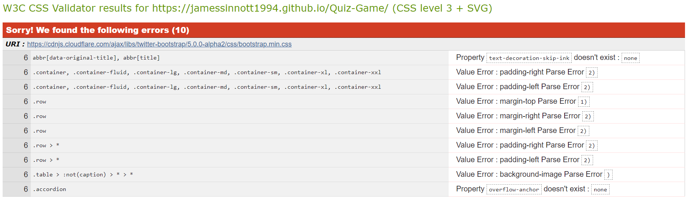
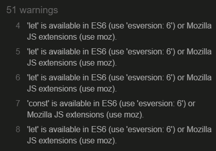
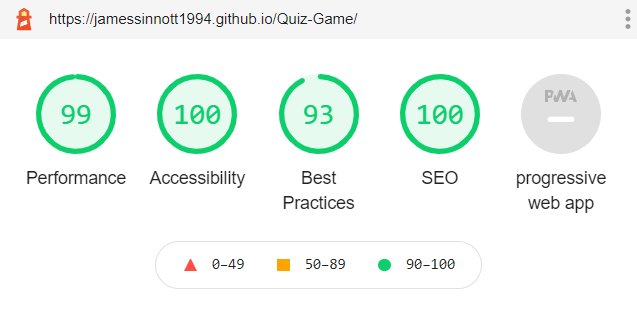
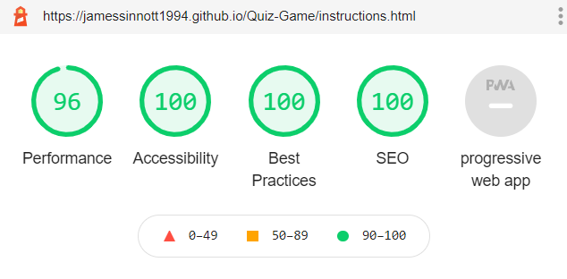
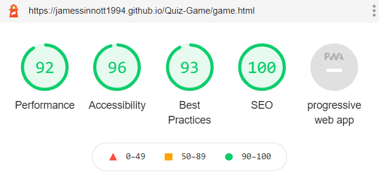

## Testing

Back to [Readme file.](README.md)

## Table of Contents
- [Browser Compatability](#browser-compatability)
- [Code Validation](#code-validation)
- [Performance Testing](#performance-testing)
- [Bugs](#bugs)

---
### Browser Compatability

- I tested the appearance and responsiveness of the website across many different devices and browsers. Generally, the appearance and responsiveness looks quite good on the different devices, and there is no difference between the browsers.

- Browsers tested:
    - Brave
    - Chrome
    - Firefox
    - Microsoft Edge
- Devices tested:
    - Windows laptop
    - iPad
    - Android Phone
- Devices tested in DevTools:
    - Moto G4
    - iPhone 6/7/8
    - iPad
- Custom responsive viewport sizes created for testing on larger screens than my laptop:
    - 1280px x 802px (Larger laptop)
    - 1600px x 992px (Desktop)

---
### Code Validation

#### Testing HTML with [The W3C Markup Validation Service](https://validator.w3.org/)

- Home page:
    - Minor warning about the section containing the "Play" and "Instructions" buttons lacking a header. Not an issue as the buttons are self-explanatory and therefore the section does not need an "identifying heading".
- Instructions page:
    - Same warning as above, this time about no h2-h6 heading element for the section containing the instructions text. Again this is not an issue for the instructions page as there is a h1 element in the header element which describes the content in the section containing the text.
- Game page:
    - 11 similar warning about the no h2-h6 heading in section elements. Again this is not an issue for the game page.
    - 5 warnings about the document containing more than one `main` element.
        - The reason for having mulitple `main` elements is that each element represents a screen of the Game page.
        - Initially, the display for 5 of the 6 `main` elements was set to none, so they were not seen until the user clicked through each of the screens. This wasn't good enough for the HTML validator however, so the solution was to add a `hidden` attribute to 5 of the elements.

#### Testing CSS with the [Jigsaw CSS Validation Service ](https://jigsaw.w3.org/css-validator/)
- There were no errors discovered for my own custom style.css file. There were however 10 errors in Bootstrap's style sheet:

- These appear to be minor errors that don't have any great effect on the performance of the game.
- Warnings were also discovered, but these relate mainly to "unknown vendor extensions", which can be safely ignored.

#### Testing JavaScript with [JSHint](https://jshint.com/)

- When I Initially put my app.js code into JSHint, I was given 51 warnings:

    - As can be seen from the image above, most of the warnings related ES6's `let` and `const` keywords.
    - This is a minor warning. The solution to get rid of the warning was to add the following comment to the top of the app.js file:
        - /*jshint esversion: 6 */
    - This had the affect of reducing the warnings from 51 to 15.

- There were 3 warnings relating to semi-colons, which were easily fixed.

- There were 11 warning's related to not using dot notation when accessing the properties of objects.
    - For example, I was using the "results" from the API using the following approach:
        - `data["results"]`
    - The solution therefore with dot notation:
        - `data.results`

- 1 error was related to my misuse of a ternary operator
    - Sorted by using an if-else statement.

- The above approaches sorted all the warnings.

---
### Performance Testing

Testing page with Lighthouse in Chrome Dev Tools to optimise performance, accessibility, best practices and SEO

#### Desktop Performance

- Lighthouse Desktop Home page report:

- Lighthouse Desktop Instructions page report:

- Lighthouse Desktop Game page report:

#### Mobile Performance

- Lighthouse Mobile Home page report:

- Lighthouse Mobile Instructions page report:

- Lighthouse Mobile Game page report:

- Performance, Accessibility, Best Practices and SEO were roughly the same on desktop and mobile. The only slight difference with performance was on mobile, however this was still of a high standard (92).

---
## Bugs

**Bug:** Bug with nav list items appearing as block elements when their containing div is shown by the jquery code.

**Fix:** The solution here was to use:

    $("#game-header").css("display", "flex");

As opposed to:

    $("#game-header").show()

**Bug:** When the height of all of the answer button divs is set intially to the max height of the largest div (based on it's text), it never then sets to the new max height for the divs of the next displayed question.

**Fix:** The solution I used was to re-create the buttons for the next displayed question. This is perhaps an inefficient way of dealing with the bug, but I couldn't figure out why the max height of the buttons would not change for the next displayed question.

**Bug:** Leaderboard data was being appended to each time the Leaderboard screen was shown.

**Fix:** Solution was to empty the Leaderboard list element using: leaderboard-list.empty()

**Bug:** Countdown timer was decrementing faster if users answered questions quickly.

**Fix:** Solution I used was to make the timer variable a global variable which was easier to turn on and off.

**Bug:** Wrong position displayed for the current user if their name already existed on the leaderboard. If there were 3 names of the same type, then it was always the position of the same name with the lowest score that was displayed (as this was the last name in the sorted leaderboard data).

**Fix:** Solution was to assign a unique userID to each user. This helped correctly displayed the position of the current user.