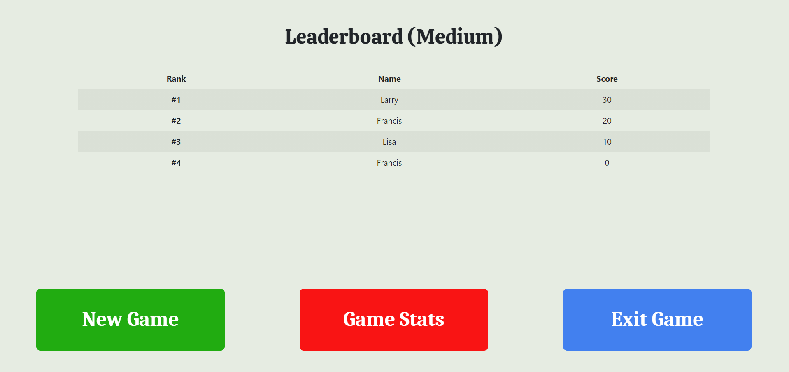

## Testing

Back to [Readme file.](README.md)

## Table of Contents
- [Functionality Testing](#functionality-testing)
- [Browser Compatability](#browser-compatability)
- [Code Validation](#code-validation)
- [Performance Testing](#performance-testing)
- [User Stories Testing](#user-stories-testing)
- [Bugs](#bugs)

---
### Functionality Testing

- Testing was applied throughout development to make sure everything worked as it should.

#### Home Page

- Play button leads to the correct destination i.e. the Game Page.
- Instructions button leads to the correct destination i.e. the Instructions Page.

#### Instructions Page

- Home button leads to the correct destination i.e. Home Page.

#### Game Page

- Username Screen:
    - User can successfully enter a username of their choice in the input box and then click the submit button. 
    - The username is successfully sent to a function to make sure the name submitted is valid.
        - If name is valid, then the Topic screen is shown.
        - If the name is not valid, then the user is prompted to enter a new name.
    - If there is a username stored in the session, then the user is successfully prompted to continue with the name in session or choose a new name.
        - "Yes" button allows user to continue with old name, which brings user to Topic screen.
        - "No" button allows user to submit a new username in the input box described above.

- Topic Screen:
    - User is presented with 8 buttons for choosing a topic.
    - When any of the buttons are clicked the user is successfully brought to the Difficulty screen.
    - Proof of success is that on the Game screen the image displayed represents the topic chosen, as do the nature of the questions.

- Difficulty Screen:
    - User is presented with 4 buttons for choosing a difficulty i.e. Easy, Medium, Hard, Random.
    - When any of the buttons are clicked, a request is then sent to retrieve the Quiz data from the Open Trivia API.
        - The user will be sent to the Game screen if the data is received without any errors.
        - An error prompt will be displayed if the data was not received correctly i.e. not enough "Easy" questions in the "Politics" category. User will then be asked to choose a different category of difficulty.

- Game Screen:
    - Modal popup window appears when user clicks "QuizUp" logo:
        - 3 menu buttons appear successfully in the Modal.
        - Timer paused successfully while modal is open.
        - "New Game" button successfully takes user back to the Username screen.
        - "Resume" button successfully resumes the current game. Timer starts again.
        - "Exit Game" button successfully takes user back to Home page.

    - Heads-Up-Display (HUD) successfully displays game information:
        - User can see their current score, this is incremented successfully when user gets answer correct.
        - User can see the time remaining to answer the question:
            - Timer decrements while the game is in-play.
            - Timer pauses when answer is chosen or Modal window is open.
            - Timer stays at 0 when time elapses.
        - User can see the amount of questions they have remaining i.e. 0/10.

    - Question from the Open Trivia API is displayed successfully beneath the topic image.

    - Four answer buttons are displayed beneath the question.
        - Clicking an answer button will create a sound i.e. Right / Wrong sound based on whether or not the answer was correct.
        - Clicking an answer button will cause the button to fill up with a red or green colour based on whether or not it is correct.
        - Clicking answer button stops timer.
        - Clicking answer button enables the Continue button with an animation which smoothly focuses on the Continue button.

    - Continue button displayed beneath the answer buttons.
        - When clicked it successfully displays the next question and scrolls the page up to the question.
        - When clicked the timer is reset to 30.
        - When clicked the number of questions answered is incremented.
        - When clicked it successfully brings to user to the Game Over screen if the user is on the last question.

- Game Over Screen:
    - User is successfully presented with their game statistics.
    - User is presented with 3 buttons.
        - "New Game" and "Exit Game" button have the same sucess conditions as above.
        - "Leaderboard" button successfully takes the user to the Leaderboard screen.

- Leaderboard Screen:
    - Successfully display the table with all the users in the game.
    - Successfully displays the user's rank, name, and score.
    - 3 buttons.
        - "New Game" and "Exit Game".
        - "Game Stats" button which successfully takes the user back to the Game Over Screen.

---
### Browser Compatability

- I tested the appearance and responsiveness of the website across many different devices and browsers. Generally, the appearance and responsiveness looks quite good on the different devices, and there is no difference between the browsers.

- Browsers tested:
    - Brave
    - Chrome
    - Firefox
    - Microsoft Edge
- Devices tested:
    - Windows laptop
    - iPad
    - Android Phone
- Devices tested in DevTools:
    - Moto G4
    - iPhone 6/7/8
    - iPad
- Custom responsive viewport sizes created for testing on larger screens than my laptop:
    - 1280px x 802px (Larger laptop)
    - 1600px x 992px (Desktop)

---
### Code Validation

#### Testing HTML with [The W3C Markup Validation Service](https://validator.w3.org/)

- Home page:
    - Minor warning about the section containing the "Play" and "Instructions" buttons lacking a header. Not an issue as the buttons are self-explanatory and therefore the section does not need an "identifying heading".
- Instructions page:
    - Same warning as above, this time about no h2-h6 heading element for the section containing the instructions text. Again this is not an issue for the instructions page as there is a h1 element in the header element which describes the content in the section containing the text.
- Game page:
    - 11 similar warning about the no h2-h6 heading in section elements. Again this is not an issue for the game page.
    - 5 warnings about the document containing more than one `main` element.
        - The reason for having mulitple `main` elements is that each element represents a screen of the Game page.
        - Initially, the display for 5 of the 6 `main` elements was set to none, so they were not seen until the user clicked through each of the screens. This wasn't good enough for the HTML validator however, so the solution was to add a `hidden` attribute to 5 of the elements.

#### Testing CSS with the [Jigsaw CSS Validation Service ](https://jigsaw.w3.org/css-validator/)
- There were no errors discovered for my own custom style.css file. There were however 10 errors in Bootstrap's style sheet:

- These appear to be minor errors that don't have any great effect on the performance of the game.
- Warnings were also discovered, but these relate mainly to "unknown vendor extensions", which can be safely ignored.

#### Testing JavaScript with [JSHint](https://jshint.com/)

- When I Initially put my app.js code into JSHint, I was given 51 warnings:

- As can be seen from the image above, most of the warnings related to ES6's `let` and `const` keywords.
    - This is a minor warning. The solution to get rid of the warning was to add the following comment to the top of the app.js file:
        - /*jshint esversion: 6 */
    - This had the affect of reducing the warnings from 51 to 15.

- There were 3 warnings relating to semi-colons, which were easily fixed.

- There were 11 warning's related to not using dot notation when accessing the properties of objects.
    - For example, I was using the "results" from the API using the following approach:
        - `data["results"]`
    - The solution therefore with dot notation:
        - `data.results`

- 1 error was related to my misuse of a ternary operator
    - Sorted by using an if-else statement.

- The above approaches sorted all the warnings.

---
### Performance Testing

Testing page with Lighthouse in Chrome Dev Tools to optimise performance, accessibility, best practices and SEO

#### Desktop Performance

- Lighthouse Desktop Home page report:

- Lighthouse Desktop Instructions page report:

- Lighthouse Desktop Game page report:

#### Mobile Performance

- Lighthouse Mobile Home page report:

- Lighthouse Mobile Instructions page report:

- Lighthouse Mobile Game page report:

- Performance, Accessibility, Best Practices and SEO were roughly the same on desktop and mobile. The only slight difference with performance was on mobile, however this was still of a high standard (92).

---
### User Stories Testing

As a **first-time player**, I want:
1. To see a visually appealing game:

- The game has a simple visual appeal, with good contrast between text and the background, as well as a nice image for the particular quiz topic.

2. To easily understand how the game works.

- The game is very intuitive, however the Instructions page provides a first time user all the details needed to play the game.

3. To be able to pick a quiz topic.

4. To be given feedback on my answers.

- User is given visual feedback on whether or not they got the correct answer.
    - Red button for wrong answer.
    - Green button for correct answer.

5. To be rewarded when I get the right answer.
    - User is rewarded by visual feedback as can be seen from image above.
    - A correct sound is played when you get the right answer.
    - Score is increased.

6. To be able to see my score.

- User's score is displayed clearly in the HUD.

As a **returning player**, I want:
1.	To skip any instructions and jump straight into a new game.

- If you are familiar with the game then you don't need to look at the instructions, you can just click the Play button to start the game.

2. To increase the difficulty for new challenges.

- User can pick a difficulty of their choice.

3. A large number of questions so that my playing experience is always different.

- There are thousands of questions available on the [Open Trivia database](https://opentdb.com/api_config.php) which will always lead to a different user experience.

As a **site owner**, I want:
1.	To provide a fun interactive game for users.

- There is plenty of interactivity in the game, from choosing your own unique username, picking topics and difficulty, and deciding which answer button to click for the correct answer to the question received from the API.

2. To provide an inituitive game that will not confuse users.
- The game is very easy to understand as it is a simple quiz game. The Instructions page should clear up any confusion.

3. To provide an educational game for users.
- There is a wide variety of topics provided for, all of which contain interesting questions and answers. A new user is bound to learn something new!

4. To create a game that is available on different devices.

- Game on iPad:

- Game on Mobile:

5. To create a game that makes users want to play it again.

- The Game Over stats screen shows how the player did, and how they are positioned on the leaderboard.

- The Leaderboard adds a competitive element to the game which will make a user want to do better compared to other players or to their own previous score.

- The "New Game" button makes it convenient to start a new game.

- A Session storage object stores the previous username and displays a prompt on the Username screen if there is a name in session. This makes it more convenient for a user to use their old name instead of typing out a new one.

- The above three factors, combined with the randomness of the questions as well as the sounds, visuals, and animations will all lead to users wanting to play the game again.

---
## Bugs

**Bug:** Bug with nav list items appearing as block elements when their containing div is shown by the jquery code.

**Fix:** The solution here was to use:

    $("#game-header").css("display", "flex");

As opposed to:

    $("#game-header").show()

**Bug:** When the height of all of the answer button divs is set intially to the max height of the largest div (based on it's text), it never then sets to the new max height for the divs of the next displayed question.

**Fix:** The solution I used was to re-create the buttons for the next displayed question. This is perhaps an inefficient way of dealing with the bug, but I couldn't figure out why the max height of the buttons would not change for the next displayed question.

**Bug:** Leaderboard data was being appended to each time the Leaderboard screen was shown.

**Fix:** Solution was to empty the Leaderboard list element using: leaderboard-list.empty()

**Bug:** Countdown timer was decrementing faster if users answered questions quickly.

**Fix:** Solution I used was to make the timer variable a global variable which was easier to turn on and off.

**Bug:** Wrong position displayed for the current user if their name already existed on the leaderboard. If there were 3 names of the same type, then it was always the position of the same name with the lowest score that was displayed (as this was the last name in the sorted leaderboard data).

**Fix:** Solution was to assign a unique userID to each user. This helped correctly displayed the position of the current user.

**Bug:** On rare occasions an answer would contain strange symbols such as letters from the Greek alphabet. This caused problems when checking if an answer was correct, as the letters appear different when they are assigned to the HTML of the buttons, compared to how they are in the data received from the API.

**Fix:** Solution here was to assign the correct answer symbol to the button's HTML, then assign the "correctAnswer" variable to the HTML of that button.

